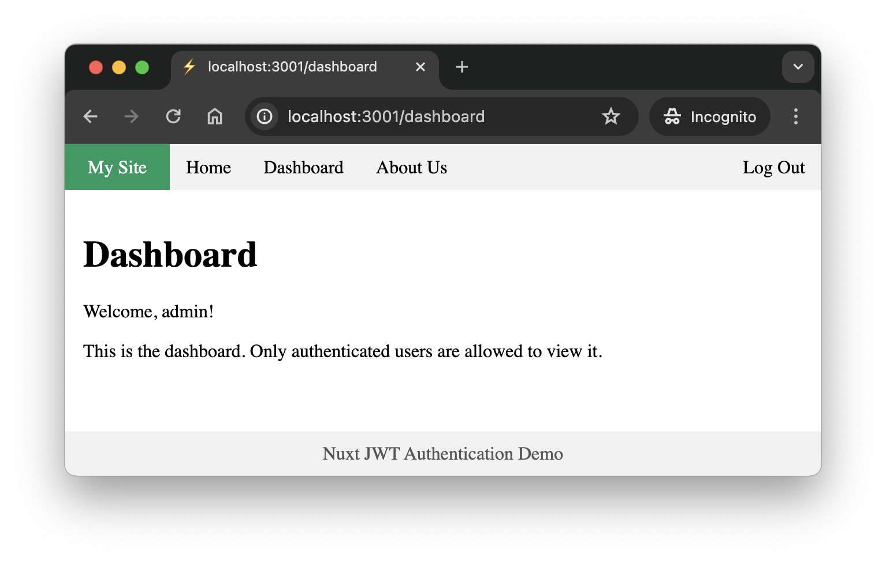

# Nuxt JWT Authentication Demo

This project demonstrates a simple authentication solution for Nuxt3 applications. It includes basic functionality for user login, logout, and session management using JSON Web Token.



## ⚠️ Disclaimer

- **This specific implementation has not been audited for security!**

- This is just a *demo* of what I had tried to get working and is mainly for educational purposes and maybe small-scale projects. Use at your own risk only after reviewing the code yourself.


## 💡 Credits

1. The [damien-hl/nuxt3-auth-example](https://github.com/damien-hl/nuxt3-auth-example) project served as a very helpful resource. You should check it out. There are similarities to this reference project in my codebase. Thanks.


## 🪄 Features

- **JWT-Based Authentication**: Uses JSON Web Token implementation from [oslo](https://oslo.js.org/) package.
- **Login and Logout**: Functionality for users to log in and log out.
- **Session Management**: Persistent sessions with configurable expiration times, including "Remember Me" functionality.
- **Protected Routes**: Middleware to protect routes and redirect unauthenticated users to the login page.
- **Public Routes**: Configurable public routes that are accessible without authentication.
- **SQLite Database**: User data stored in an SQLite database with bcrypt for salted password hashing.
- **User Identity Retrieval**: Middleware and endpoints to retrieve and maintain user session information.
- **Responsive Interface**: Simple and responsive UI with navigation and authentication status display.
- **SSR-Friendly**: Designed with Nuxt Server-Side Rendering in mind. Core features still work without needing a clientside JS engine! You can even interactively authenticate from browsers like `w3m` *(just remember to enable cookies)*.


## 📋 Requirements

- NodeJS Version 20 or higher.


## 🏁 How to use it

1. Get dependencies with your package manager.

    ```sh
    yarn install
    ```

2. Generate a new SQLite database and add an account with the included script.

    ```sh
    # Change the placeholders
    node ./scripts/manage_db.js myusername mypassword
    ```

3. Copy the `.env.example` file to `.env`.

    ```sh
    cp .env.example .env
    ```

4. Change the secret value for the JSON Web Token. You can generate a sample one with the included script and use it as the value for `APP_JWT_SECRET` in `.env` fle.

    ```sh
    node ./scripts/generate_secret.js

    # You copy the secret output and paste it in the .env file
    vi .env
    ```

5. Start the development server and play around with it!

    ```sh
    yarn run dev
    ```